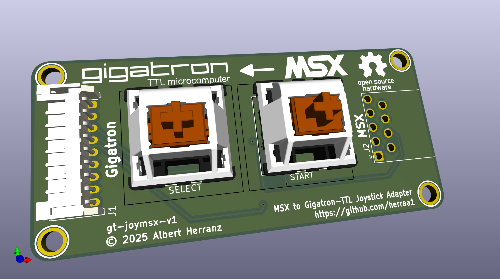
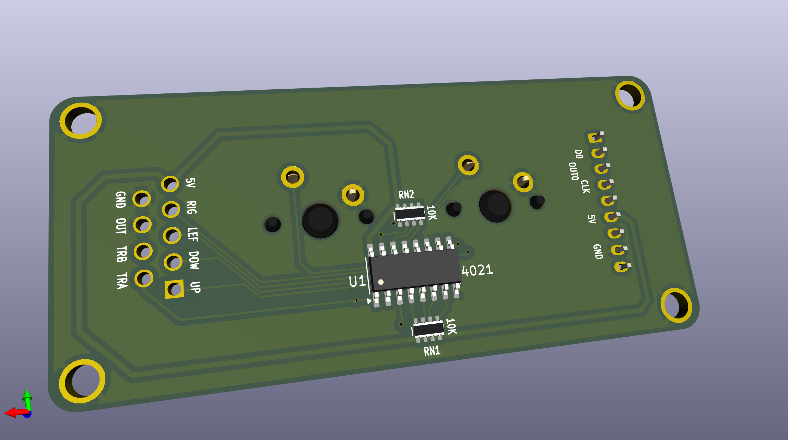
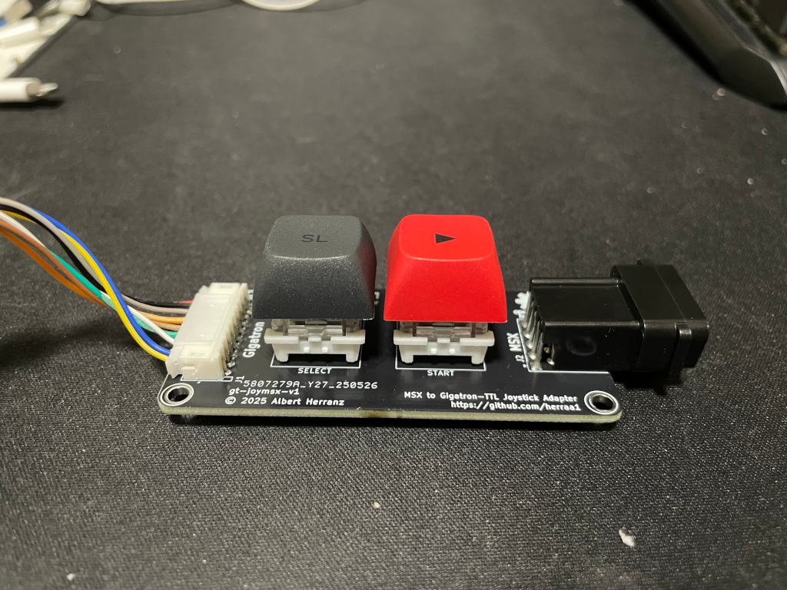
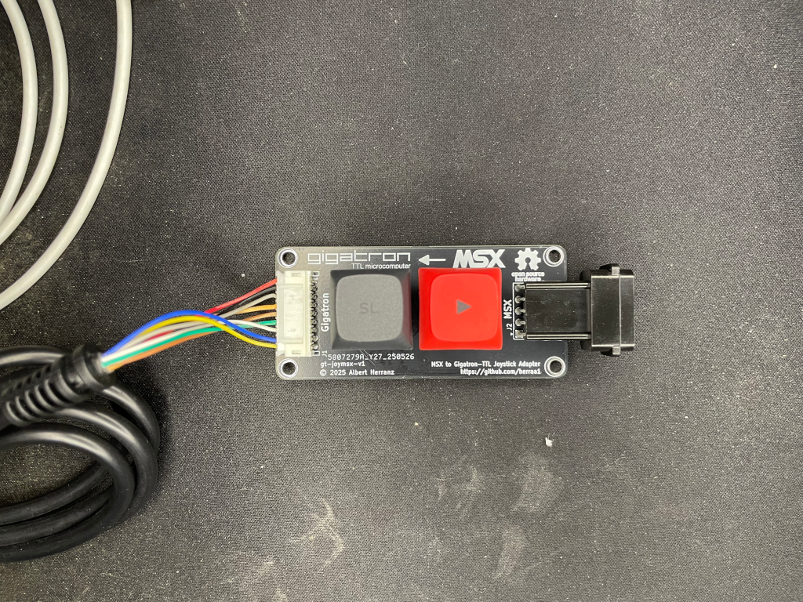
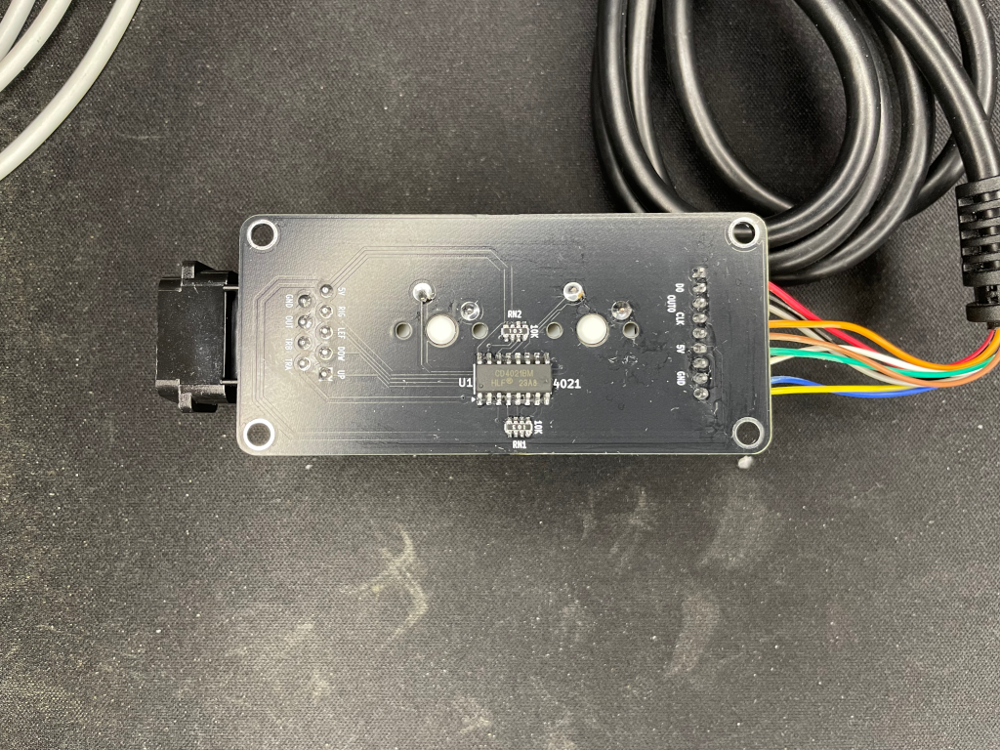

# MSX Joystick to Gigatron TTL microcomputer Joystick adapter (gt-joymsx) v1

Connect [MSX Joysticks](https://www.msx.org/wiki/Joystick/joypad_controller) to the [Gigatron TTL microcomputer](https://gigatron.io/).

> [!NOTE]
>
> No build instructions are yet provided, but if you are brave enough go for the [recommended build](#recommended-build).
>

## Introduction

The gt-joymsx v1 is an adapter that allows connecting MSX joysticks to the Gigatron TTL microcomputer.

The main features of the gt-joymsx v1 adapter are:
* small footprint
* made of widely available electronic components
* behaves as a cord extension between the Gigatron TTL microcomputer and the MSX joystick
* uses an extension cable with a female DE9 connector on the adapter's Gigatron TTL microcomputer joystick side
* uses a male DE9 PCB connector on the adapter's MSX joystick side
* no need for external power supply, the adapter draws current from the Gigatron TTL microcomputer joystick port
* super low power consumption

## [Hardware](hardware/kicad/)

The Gigatron TTL microcomputer uses [9-pin Famiclone compatible joysticks](https://www.nesdev.org/wiki/Controller_port_pinout). Those joysticks use a [Texas Instruments 4021 or compatible](https://www.ti.com/lit/ds/symlink/cd4021b.pdf) to latch and serialize the information about the pressed joystick buttons and arrows.

The [standard MSX joysticks](https://www.msx.org/wiki/Joystick/joypad_controller) are completely passive and have parallel signals for each of the buttons and arrows. The MSX computers pull up by default the signals when a MSX joystick is connected, and the MSX joysticks pull the signals to the OUT signal (pin8) when buttons or arrows are pressed (see page 27 of [MSX Technical Data Book](https://map.grauw.nl/resources/system/msxtech.pdf) for a schematic).

The gt-joymsx v1 adapter uses a CD4021BM integrated circuit to convert the signals from the MSX joystick buttons and arrows to the 9-pin Famiclone expected signalling.
As the MSX joysticks lack the `SELECT` and `START`buttons of the Famiclone joysticks, the gt-joymsx v1 adapter itself also provides two Cherry-compatible key switches to add those two buttons.

A two-sided printed circuit board (PCB) is used to put together all components:
* An angled Sega DE9 PCB male connector is used to directly connect the MSX joystick
* A PH2.0 connector is used to connect the Gigatron TTL microcomputer joystick cable extension
* Two Cherry-compatible key switches to implement the `SELECT` and `START` buttons
* the CD4021BM CMOS 8-Stage Static Shift Register
* A pair of pull-up resistor networks to provide default signals for buttons and arrows

Connection to the Gigatron TTL microcomputer joystick port is implemented using a DE9 joystick extension cable with a female DE9 connector on one side and a loose end on the other side.
The joystick extension cable loose end is wired according to the following pinout mapping.

|  |
|:--|
| Gigatron TTL microcomputer joystick connector pinout, from adapter extension cable plug side |

| Gigatron side pin | Cable color (may vary) | Signal         |
| ----------------- | ---------------------- | -------------- |
| 1                 | Red                    | unconnected    |
| 2                 | Black                  | SER_DATA/D0    |
| 3                 | Grey                   | SER_LATCH/OUT0 |
| 4                 | Orange                 | SER_PULSE/CLK  |
| 5                 | Brown                  | unconnected    |
| 6                 | Green                  | +5V            |
| 7                 | White                  | unconnected    |
| 8                 | Blue                   | GND            |
| 9                 | Yellow                 | unconnected    |

| MSX side pin | Signal |
| ------------ | ------ |
| 1            | UP     |
| 2            | DOWN   |
| 3            | LEFT   |
| 4            | RIGHT  |
| 5            | +5v    |
| 6            | TRIGA  |
| 7            | TRIGB  |
| 8            | GND    |
| 9            | GND    |

### Recommended Build

Please, use [gt-joymsx-v1 Build1](#build1) for making boards.

### [Build1](hardware/kicad/gt-joymsx-v1-build1)

[Bill Of Materials (BoM)](https://html-preview.github.io/?url=https://raw.githubusercontent.com/herraa1/gt-joymsx-v1/main/hardware/kicad/gt-joymsx-v1-build1/bom/ibom.html)

This board has been successfully built and works fine.

## [Enclosure](enclosure/)

TBD

## Tips

* By using this adapter in combination with a [msx-joyblue](https://github.com/herraa1/msx-joyblue-v2) adapter you can play games on the Gigatron TTL microcomputer using bluetooth adapters (for example, you can play _Racer_ using a Nintendo Wii Remote with a Wheel)

## References

Gigatron TTL microcomputer
- https://gigatron.io

MSX general purpose I/O port
* https://www.msx.org/wiki/General_Purpose_port

Famiclone pinout
- https://www.nesdev.org/wiki/Controller_port_pinout

4021 pinout
* https://www.nesdev.org/wiki/4021

## Image Sources

* https://www.oshwa.org/open-source-hardware-logo/
* https://en.wikipedia.org/wiki/File:Numbered_DE9_Diagram.svg
